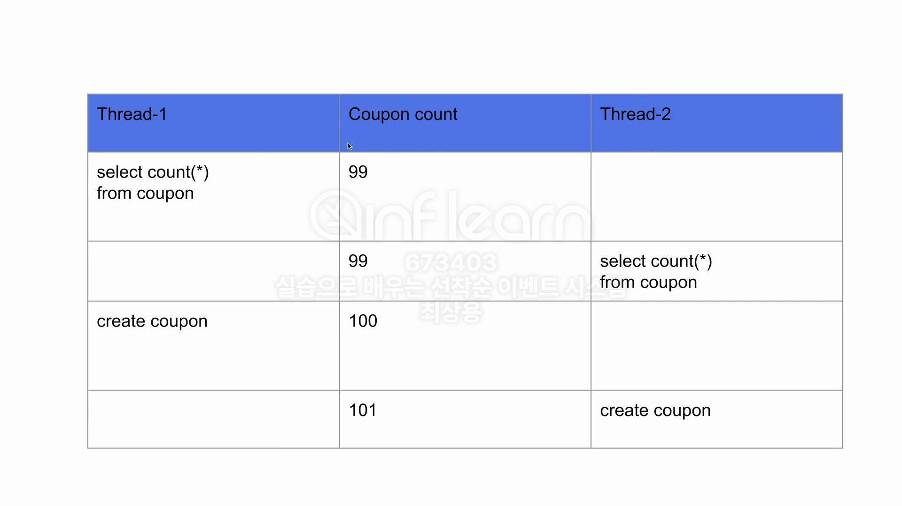

# Concurrency_issues_2
## 레이스 컨디션 발생 
쿠폰발급과정에서 정합성이 안맞는 오류가 날 수 있다.

## Redis - INCR을 이용한 해결책
1. Redis + MySQL을 활용해 락을 구현할 수 있지만 발급+ 쿠폰개수 +쿠폰생성 등에 락을 거는것은 성능에 불이익이 있을 수 있다.

2. Redis에는 INCR이라는 명령어가 존재.
키에 대한 value를 1씩 증가시킴.
Redis는 싱글스레드 기반으로 동작하여 레이스 컨디션을 해결할 수 있을 뿐만아니라
INCR명령어도 성능이 굉장히 빠르다.

## 문제점
   
서버에 트래픽이 몰리면 ?

위와 같은 시나리오로는 쿠폰생성이 100분이 걸리고
그 이후 들어온 주문생성/회원가입 요청은 타임아웃옵션에 의해 처리가 안되고 
일부 쿠폰도 생성이 되지 않는 오류가 발생할 수 있다.